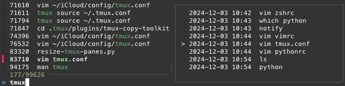

# zsh fzf history search with context

A zsh plugin that replaces `ctrl-r` with an fzf-driven, searchable list of history, and also gives
you the context around the selected command (what executed before and after).

It also lets you "jump" into that context with `tab` in order to select another command from there
to recover.

You may also use `ctrl-/` to toggle the fzf preview pane in case you would like to see longer
commands.



## Requirements
* [fzf](https://github.com/junegunn/fzf)

## Installation

### oh-my-zsh

Clone the repository inside your oh-my-zsh repo:

``` sh
git clone https://github.com/tomerha/zsh-fzf-history-search-context ${ZSH_CUSTOM:=~/.oh-my-zsh/custom}/plugins/zsh-fzf-history-search-context
```

Enable it in your `.zshrc` by adding it to your plugin list:

```
plugins=(… zsh-fzf-history-search-context)
```

## Configuration Variables

| Variable                                  | Default                                 | Description                                                                                                |
| ----------------------------------------- | --------------------------------------- | ---------------------------------------------------------------------------------------------------------- |
| `ZSH_FZF_HISTORY_SEARCH_CONTEXT_BIND`     | `'^r'`                                  | Keybind to trigger search                                                                                  |
| `ZSH_FZF_HISTORY_SEARCH_CONTEXT_HEIGHT`   | `0` (unlimited)                         | Limit the fzf height to this much                                                                          |
| `ZSH_FZF_HISTORY_SEARCH_CONTEXT_STYLE`    | `minimal`                               | The fzf `--style` to use                                                                                   |
| `ZSH_FZF_HISTORY_SEARCH_CONTEXT_HIDE`     | `` (disabled)                           | Hide the fzf preview pane by default                                                                       |

## Thanks

This plugin took inspiration from https://github.com/joshskidmore/zsh-fzf-history-search.
